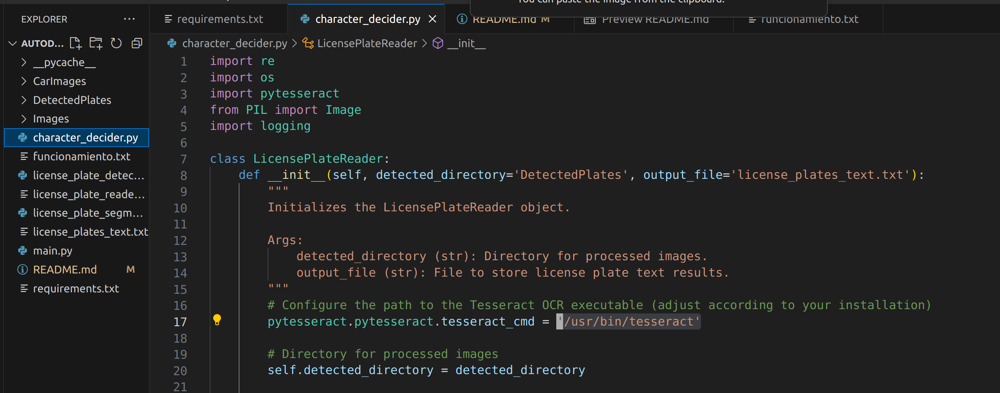
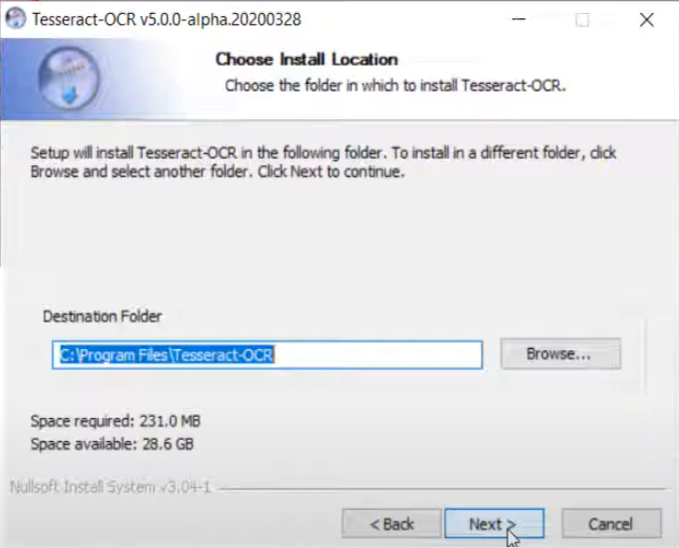
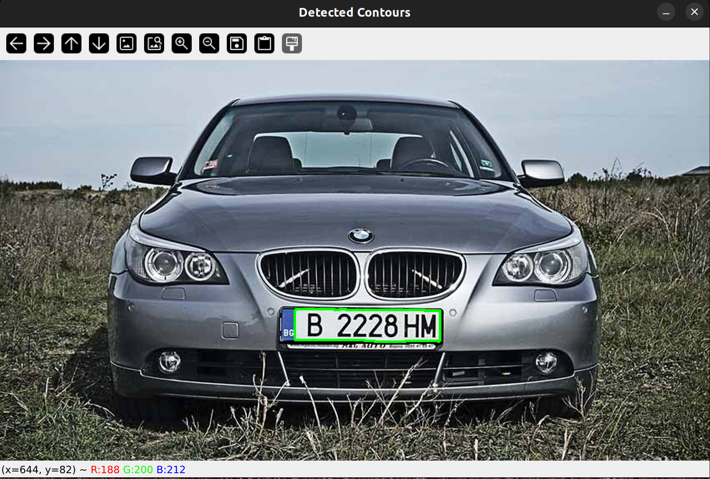
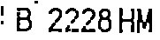

# Proyecto Final - Asignatura TIM 🚀

## 1. Introducción y Objetivo ℹ️

Este repositorio contiene el proyecto final desarrollado para la asignatura de  (TIM) en la Universidad Rey Juan Carlos. El objetivo principal del proyecto es la **segmentación y reconocimiento de matrículas**, es decir:

* Obtener una imagen **independiente** solamente con la matricula.
* Generar un texto **equivalente** a los carácteres de la matricula.

Para la resolución del problema se han puesto en práctica los conceptos vistos en el tema 2 (tratamiento de imágenes), y la implementación de un modelo entrenado (esencialmente un decisor) que nos ayuda a identificar los carácteres en la matricula. 

## 2. Instalación y ejecución ⚙️

### ¡Pruebalo tu mismo! (Ubuntu)

1. **Paso 1:** Clona el repositorio en tu máquina local.

    ```bash
    git clone https://github.com/aMonteSl/Autodetector_Matriculas.git
    ```

2. **Paso 2:** Navega al directorio del proyecto.

    ```bash
    cd Autodetector_Matriculas
    ```

3. **Paso 3:** Instala las dependencias[^1].

    ```bash
    pip install -r requirements.txt 
    ```

4. **Paso 4:** Instalamos el modelo entrenado y más dependencias.

    ```bash
    sudo apt install tesseract-ocr
    sudo apt install libtesseract-dev
    ```

5. **Paso 5:** Copiamos la salida de este comando.

    ```bash
    which tesseract
    ```

6. **Paso 6:** Configuramos el programa.

- Abrimos en nuestro editor favorito el programa `character_decider.py`. Pegamos en la línea 17 la salida del comando anterior. Quedaría algo así:



7. **Paso 7:** Ejecución del programa.

- Probado en Ubuntu usando python3.10 como interprete

   ```bash
    python3 .\main.py 
    ```

[^1]: en caso de no tener instalado pip --> `sudo apt install python3-pip`.

### ¡Pruebalo tu mismo! (Windows)

1. **Paso 1:** Clona el repositorio en tu máquina local.

    ```bash
    git clone https://github.com/aMonteSl/Autodetector_Matriculas.git
    ```

2. **Paso 2:** Navega al directorio del proyecto.

    ```bash
    cd Autodetector_Matriculas
    ```

3. **Paso 3:** Instala las dependencias[^1].

    ```bash
    pip install -r requirements.txt 
    ```

4. **Paso 4:** Instalamos el modelo entrenado y mas dependencias.

- El video explica cómo crear un entorno virtual. No hacer el entorno virtual, genera conflicto entre librerias internas del sistema que son necesarias.
- En el requitements.txt ya esta introducido el comando: pip install pytesseract

    [Tutorial instalación pytesseract](https://www.youtube.com/watch?v=OutxRdkNOK4&t=471s&ab_channel=TruzzBlogg)

5. **Paso 5:** Copiamos la ruta de instalacion de pytesseract.



6. **Paso 6:** Configuramos el programa.

- Abrimos en nuestro editor favorito el programa `character_decider.py`. Pegamos en la línea 17 la ruta que hemos copiado en el anterior paso. Quedaría algo así:


7. **Paso 7:** Ejecución del programa.
   
- Probado en Windows usando python3.12 como interprete

   ```bash
    python3 .\main.py 
    ```

### ¡Pruebalo tu mismo! (Mac)

- Para la instalación en Mac, simplemente sigue los pasos similares a los de Windows. En cuanto a la instalación del modelo entrenado, consulta el video de Windows hasta la sección donde distingue la instalación entre sistemas operativos. Posteriormente, sigue las instrucciones proporcionadas en el manual de usuario de Pytesseract. En el caso de Mac, no hemos encontrado vídeos ni explicaciones sencillas específicas para esta etapa, y no hemos podido realizar pruebas en este sistema operativo.

> [!WARNING]
> Esta instalación no es trivial y pueden surgir problemas en el camino. Si tienes alguno, por favor, contacta con nosotros por correo o teléfono indicando el **sistema operativo** que estas usando:
> Preferentemente contactar a Carlos Nebril para problemas con la instalacion en Ubuntu y para Windows recomendamos contactar con Adrián Montes.
> - c.nebril.2020@alumnos.urjc.es / a.montesl.2020@alumnos.urjc.es
> - 654 63 12 07 / 637 68 23 61


## 3. Metodología 🛠️

Este programa emplea avanzadas técnicas de procesamiento de imágenes para la detección de matrículas en una imagen. El proceso se divide en dos fases fundamentales:

### 1. Segmentación de Matrículas:
Mediante el empleo de técnicas de procesamiento de imágenes, podremos reconocer la matrícula de un vehículo en una imagen. Posteriormente, almacenaremos dicha matrícula como otra imagen independiente, la cual será utilizada en la siguiente fase. 

Los archivos usados para esta tarea son: [`license_plate_detector.py`](https://github.com/aMonteSl/Autodetector_Matriculas/blob/main/license_plate_detector.py) y [`license_plate_segmenter.py`](https://github.com/aMonteSl/Autodetector_Matriculas/blob/main/license_plate_segmenter.py). Los códigos estan bien documentados para su correcta compresión, aun así, vamos a hacer un pequeño resumen de su funcionalidad básica.

#### [`license_plate_detector.py`](https://github.com/aMonteSl/Autodetector_Matriculas/blob/main/license_plate_detector.py)

Este script implementa un lector de placas de matrícula que utiliza operaciones de procesamiento de imágenes para detectar y extraer la región de la placa de matrícula de una imagen dada. Aquí está un resumen de las principales funciones y su funcionalidad:

|          Función         |                                                                                                   Descripción                                                                                                  |
|:------------------------|:--------------------------------------------------------------------------------------------------------------------------------------------------------------------------------------------------------------|
| grayscale                | Convierte la imagen a **escala de grises** y aplica desenfoque.                                                                                                                                                |
| apply_threshold          | Aplica **umbral binario** inverso a la imagen.                                                                                                                                                                 |
| apply_adaptive_threshold | Aplica **umbral adaptativo** a la imagen.                                                                                                                                                                      |
| find_contours            | Encuentra **contornos** en la imagen.                                                                                                                                                                          |
| filter_candidates        | Filtra los contornos **candidatos** basados en área y relación de aspecto.                                                                                                                                     |
| get_lowest_candidate     | Obtiene el **contorno candidato** con la coordenada Y más baja (las matrículas del coche suelen estar en la parte baja de las imágenes).                                                                           |
| crop_license_plate       | **Recorta** la región de la placa de matrícula de la imagen original con un margen expandido.                                                                                                                  |
| close_and_open           | Aplica operaciones morfológicas de **cierre y apertura** a la imagen (daba mejores resultados que hacerlo como lo vimos en clase, es decir, al revés).                                                         |
| clear_border             | **Limpia** el borde de la imagen utilizando skimage.segmentation.clear_border.                                                                                                                                 |
| invert_image             | **Invierte** los colores de la imagen.                                                                                                                                                                         |
| draw_contours            | **Dibuja contornos** en la imagen original.                                                                                                                                                                    |
| read_license             | **Método principal** para leer la placa de matrícula: procesa la imagen, detecta contornos, filtra candidatos y devuelve la imagen procesada final o un mensaje de error si no se encuentra la placa de matrícula. |

El script se puede utilizar proporcionando una imagen como entrada y llamar a la función `read_license` del objeto `LicensePlateReader` para procesar la imagen y mostrar la región de la placa de matrícula detectada o un mensaje de error si no se encuentra ninguna placa.

#### [`license_plate_segmenter.py`](https://github.com/aMonteSl/Autodetector_Matriculas/blob/main/license_plate_segmenter.py)

El script PlateSegmentation realiza la segmentación de placas de matrícula en imágenes de vehículos. Aquí está un resumen de sus principales funciones y su funcionalidad:

|          Función          |                                                                                                   Descripción                                                                                                  |
|:-------------------------|:--------------------------------------------------------------------------------------------------------------------------------------------------------------------------------------------------------------|
| __init__                  | Inicializa el objeto PlateSegmentation con constantes y una **instancia** de LicensePlateReader. Borra y crea un directorio para almacenar las placas detectadas.                                              |
| clear_terminal            | **Limpia** la pantalla del terminal.                                                                                                                                                                           |
| load_images               | Carga y muestra imágenes disponibles para procesamiento, **solicitando** al usuario que haga una selección. Retorna el número de la selección y el nombre del archivo de imagen seleccionado.                  |
| process_image             | **Procesa** la imagen seleccionada, muestra el resultado y guarda la imagen procesada.                                                                                                                         |
| display_and_save_result   | **Muestra** la imagen procesada, la guarda y registra las entradas del usuario.                                                                                                                                |
| segmentation_of_the_plate | **Método principal** para la **segmentación** de placas. Carga imágenes, procesa cada imagen y permite al usuario continuar o salir.                                                                           |
| crop_license_plate        | **Recorta** la región de la placa de matrícula de la imagen original con un margen expandido.                                                                                                                  |
| close_and_open            | Aplica operaciones morfológicas de **cierre y apertura** a la imagen (daba mejores resultados que hacerlo como lo vimos en clase, es decir, al revés).                                                         |
| clear_border              | **Limpia** el borde de la imagen utilizando skimage.segmentation.clear_border.                                                                                                                                 |
| invert_image              | **Invierte** los colores de la imagen.                                                                                                                                                                         |
|       draw_contours       | **Dibuja** contornos en la imagen original.                                                                                                                                                                    |
|        read_license       | **Método principal** para leer la placa de matrícula: procesa la imagen, detecta contornos, filtra candidatos y devuelve la imagen procesada final o un mensaje de error si no se encuentra la placa de matrícula. |

### 2. Reconocimento de Texto:
Este programa en Python ([`character_decider.py`](https://github.com/aMonteSl/Autodetector_Matriculas/blob/main/character_decider.py)) es un lector de placas que utiliza la biblioteca Tesseract OCR para procesar imágenes y extraer texto de placas de vehículos. Se trata de un modelo preentrenado especificamente para eso donde, internamente, esta implementado los conceptos del tema 3: decisores. 

#### 1. [`character_decider.py`](https://github.com/aMonteSl/Autodetector_Matriculas/blob/main/character_decider.py)


|        Función       |                                                                                                                                                                              Funcionalidad                                                                                                                                                                              |
|:--------------------|:-----------------------------------------------------------------------------------------------------------------------------------------------------------------------------------------------------------------------------------------------------------------------------------------------------------------------------------------------------------------------|
| __init__             | **Inicializa** el objeto LicensePlateReader. **Configura** el directorio para imágenes procesadas y el archivo de salida para almacenar los resultados de texto de las placas. También configura la ruta al ejecutable de Tesseract OCR y la configuración de registro (logging).                                                                                               |
| read_license_plates  | **Lee placas de vehículos** a partir de imágenes procesadas y escribe los resultados en un archivo. Verifica si el directorio especificado existe, obtiene una lista de archivos ordenados numéricamente en el directorio, y procesa cada imagen para extraer el texto de la placa. **Imprime** los resultados en la terminal y **escribe** los resultados en el archivo de salida. |
| read_text_from_image | **Lee el texto de una imagen** utilizando Tesseract OCR. Abre la imagen especificada, utiliza pytesseract para extraer el texto de la imagen y **filtra los caracteres no deseados**, devolviendo el texto filtrado.                                                                                                                                                            |

### 3. Extra:
Además, en el proceso de ejecución del programa crearemos distintos `.txt` donde podremos ir viendo lo que ocurre internamente en el programa, a continuación un ejemplo de cada uno:

#### 1. [`user_inputs.txt`](https://github.com/aMonteSl/Autodetector_Matriculas/blob/main/DetectedPlates/user_inputs.txt): 
Este fichero contendra la información de que imagenes a seleccionado el usuario, el nombre del fichero imagen que ha seleccionado y el directorio donde se encuentra la imagen, ejemplo:

    User choice: 1, Selected image: 1_Coche.jpg. Path: C:\Users\adrian\Escritorio\AutoMatriculas\DetectedPlates\plate1.jpg
    User choice: 8, Selected image: 8_Coche.jpg. Path: C:\Users\adrian\Escritorio\AutoMatriculas\DetectedPlates\plate8.jpg
    
#### 2. [`license_plates_text.txt`](https://github.com/aMonteSl/Autodetector_Matriculas/blob/main/license_plates_text.txt): 
En este fichero guardaremos la información respecto el nombre de la imagen que contiene la matricula (es decir la imagen generada en la primera fase) y el texto que se ha detectado en dicha imagen, ejemplo:

    Image Path: plate1.jpg, Plate Text: B2228HM
    Image Path: plate8.jpg, Plate Text: 0007LLL

#### 3. [`license_plates_reader.log`](https://github.com/aMonteSl/Autodetector_Matriculas/blob/main/license_plate_reader.log): 
En este fichero simplemente se guardan errores que ocurran en la segunda fase, como por ejemplo que no se haya podido detectar texto en la imagen o errores similares, ejemplo:

    ERROR:root:Error while processing images: 'NoneType' object has no attribute 'group'

## 4. Resultados 📊

Vamos a ir siguiendo los pasos de la [metodología](https://github.com/aMonteSl/Autodetector_Matriculas/blob/main/README.md#3-metodolog%C3%ADa-%EF%B8%8F), mostrando los resultados generados en cada fase.

### 1. Segmentación de matrículas

- Imagen original:


- Placa detectada:




### 2. Reconocimiento de texto

- Placa aislada: 



Aplicamos el modelo entrenado **pytesseract**:

- `license_plates_text.txt`:

```Image Path: plate1.jpg, Plate Text: B2228HM```

### DEMO 

- [**Haz click aquí para un video demonstración del proceso completo**](enlace-al-video)

## 5. Discusión 💬

Se discuten los resultados obtenidos en relación con [estándares, trabajos previos, etc.]. Además, se analizan posibles limitaciones, áreas de mejora y aspectos relevantes.

## 6. Conclusión 🎯

En conclusión, [resumen de las conclusiones principales]. Se destaca la importancia de los hallazgos y se mencionan posibles direcciones futuras para la investigación o aplicaciones.

## 7. Referencias 📜

Se proporciona un listado de las fuentes bibliográficas, recursos y documentos consultados durante el desarrollo del proyecto.

---

¡Gracias por visitar nuestro repositorio! Esperamos que encuentres este proyecto interesante y útil. 👩‍💻👨‍💻


